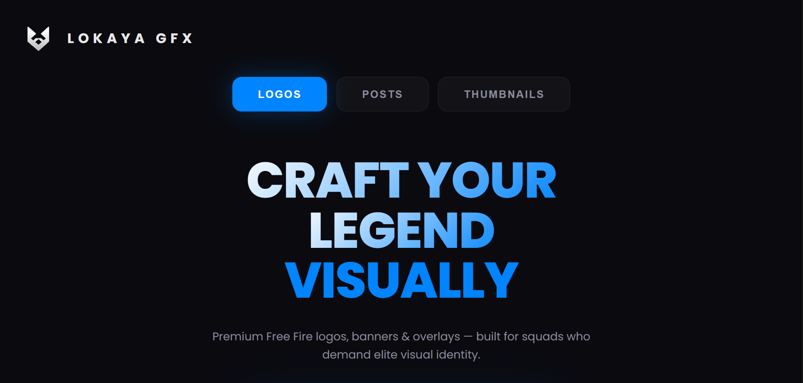
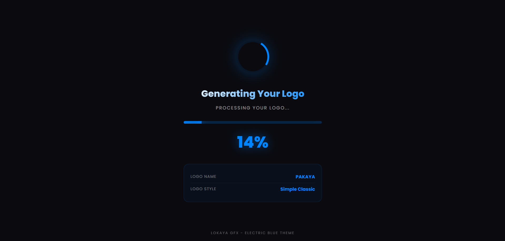

# ⚡ Lokaya Gfx - Free Fire Logo Maker

<div align="center">


**Premium Free Fire Logo Generator**  
*Craft your legend visually*

[](https://lokayafx.github.io/Free-editing/)
[](https://github.com/LokayaFx/Free-editing/releases)
[](LICENSE)

</div>

---

## 🎯 Overview

Lokaya gFx Logo Maker is a **free, web-based tool** for creating professional Free Fire gaming logos. Built with modern web technologies and featuring an electric blue premium design, it offers instant logo generation with customizable text fields.

### ✨ Key Features

- 🎨 **Electric Blue Premium Theme** - Modern gradient-based UI
- ⚡ **Instant Logo Generation** - Powered by Photopea API
- 📱 **Fully Responsive** - Optimized for mobile and desktop
- 🚀 **Zero Dependencies** - Pure HTML/CSS/JavaScript
- 💾 **Direct PNG Download** - High-quality output
- 🎯 **Single-Page Design** - No scrolling, everything visible

---

## 🚀 Quick Start

### Live Demo

Visit **[lokayafx.github.io/Free-editing](https://lokayafx.github.io/Free-editing/)** to try it now!

### Local Development

```bash
# Clone the repository
git clone https://github.com/LokayaFx/Free-editing.git

# Navigate to directory
cd Free-editing

# Open in browser
open index.html
# or
python -m http.server 8000
```

Then visit `http://localhost:8000`

---

## 📸 Screenshots

### Home Page


### Rendering Process


---

## 🎨 Features

### User Interface
- **Clean Single-Page Layout** - Everything accessible without scrolling
- **Gradient Hero Text** - Eye-catching "CRAFT YOUR LEGEND VISUALLY"
- **Glassmorphism Navigation** - Modern frosted-glass effect buttons
- **Responsive Typography** - Scales from mobile (2.5rem) to desktop (4rem)

### Logo Customization
- **Name Field** - Your gaming name/squad name
- **Whatsapp Number** - Optional contact information
- **Title Field** - Subtitle (e.g., "LEGEND", "PRO", "GAMING EDITOR")

### Rendering System
- **Photopea Integration** - Professional PSD manipulation
- **Real-time Progress Bar** - Visual feedback during generation
- **Automatic Download** - PNG file with custom filename
- **120s Timeout** - Extended processing for reliability

---

## 🛠️ Technology Stack

| Technology | Purpose |
|------------|---------|
| HTML5 | Structure and semantic markup |
| CSS3 | Styling, gradients, and animations |
| JavaScript (Vanilla) | Logic and Photopea API integration |
| Photopea API | PSD processing and PNG export |
| Cloudinary | CDN for logo assets |
| Poppins Font | Premium typography |

---

## 📁 File Structure

```
Free-editing/
│
├── index.html              # Main landing page (electric blue theme)
│
├── rendering/
│   └── index.html          # Logo rendering page
│
├── js/
│   └── render.js           # Photopea API integration logic
│
├── assets/
│   ├── logos/
│   │   └── s1_c1.png       # Logo preview image
│   ├── psds/
│   │   └── s1_c1.psd       # Photopea template file
│   └── Muro.otf            # Custom font for logos
│
├── README.md               # This file
└── LICENSE                 # License information
```

---

## 🎨 Design System

### Color Palette

```css
/* Primary Colors */
--dark-bg: #0a0a0f;           /* Main background */
--dark-card: #15151a;         /* Card backgrounds */
--electric-blue: #0084ff;     /* Primary accent */
--blue-glow: rgba(0, 132, 255, 0.3);  /* Glow effects */

/* Text Colors */
--text-white: #ffffff;        /* Primary text */
--text-gray: #8b8b9a;         /* Secondary text */
--text-dark-gray: #52525e;    /* Placeholder text */
```

### Typography

- **Primary Font:** Poppins (weights: 300, 400, 600, 700, 800)
- **Fallback:** System fonts (-apple-system, BlinkMacSystemFont, Segoe UI)

### Responsive Breakpoints

```css
/* Desktop */
@media (min-width: 768px) { ... }

/* Mobile */
@media (max-width: 480px) { ... }

/* Small Mobile */
@media (max-width: 380px) { ... }
```

---

## 🔧 How It Works

### Logo Generation Flow

1. **User Input** - User enters name, number, and title
2. **Redirect** - System redirects to rendering page with URL parameters
3. **PSD Loading** - Photopea loads s1_c1.psd from GitHub
4. **Text Injection** - JavaScript updates PSD layers:
   - `LogoName` - User's name
   - `LogoNumber` - Whatsapp number
   - `LogoTitel` - Under-name title
5. **PNG Export** - Photopea converts PSD to PNG
6. **Download** - Browser downloads `YOURNAME_S1C1_Logo.png`
7. **Redirect** - Auto-redirect back to home page

### Technical Implementation

```javascript
// Photopea API Configuration
const config = {
    files: [psdUrl, fontUrl],
    script: photopeaScript,
    serverMode: true
};

// Iframe injection
iframe.src = "https://www.photopea.com#" + encodeURI(JSON.stringify(config));

// Message handler for PNG data
window.addEventListener("message", function(e) {
    if (e.data instanceof ArrayBuffer) {
        // Download logic
    }
});
```

---

## 🚀 Deployment

### GitHub Pages (Recommended)

1. **Fork this repository**
2. Go to **Settings → Pages**
3. Set **Source** to `main` branch and `/ (root)` folder
4. Click **Save**
5. Your site will be live at `https://yourusername.github.io/Free-editing/`

### Custom Domain

1. Add `CNAME` file with your domain
2. Configure DNS:
   ```
   Type: CNAME
   Name: www
   Value: yourusername.github.io
   ```
3. Enable **Enforce HTTPS** in GitHub Pages settings

---

## 📝 Usage

### Basic Usage

```html
<!-- Direct link to logo maker -->
<a href="https://lokayafx.github.io/Free-editing/">
  Create Your Logo
</a>
```

### URL Parameters

```
https://lokayafx.github.io/Free-editing/rendering/
  ?name=LOKAYA
  &number=0768803361
  &title=GAMING%20EDITOR
```

---

## 🐛 Known Issues

- ⏰ **Timeout on slow connections** - May fail if internet speed < 2 Mbps
- 📱 **Mobile browser compatibility** - Works best on Chrome/Safari mobile
- 🎨 **PSD layer names** - Must match exactly: LogoName, LogoNumber, LogoTitel

---

## 🔮 Roadmap

### v2.1.0 (Planned)
- [ ] Canvas-based post maker system
- [ ] Thumbnail generator with templates
- [ ] Multiple logo styles (s1, s2, s3)
- [ ] Character selection (c1-c9)

### v3.0.0 (Future)
- [ ] User account system
- [ ] Save and load designs
- [ ] Custom color schemes
- [ ] Advanced text effects
- [ ] Batch processing

---

## 🤝 Contributing

Contributions are welcome! Please follow these steps:

1. **Fork** the repository
2. **Create** a feature branch (`git checkout -b feature/AmazingFeature`)
3. **Commit** your changes (`git commit -m 'Add AmazingFeature'`)
4. **Push** to the branch (`git push origin feature/AmazingFeature`)
5. **Open** a Pull Request

### Development Guidelines

- Follow existing code style
- Test on multiple browsers
- Optimize for mobile devices
- Comment complex logic
- Update documentation

---

## 📄 License

**© 2026 Lokaya Fx. All Rights Reserved.**

This project is proprietary software. Unauthorized copying, modification, distribution, or use of this software is strictly prohibited without explicit permission from the owner.

For licensing inquiries, contact: [lnk.bio/LokayaFx](https://lnk.bio/LokayaFx)

---

## 👤 Author

**Lokaya Fx**

- Website: [lokaya-gfx.vercel.app](https://lokaya-gfx.vercel.app)
- Contact: [lnk.bio/LokayaFx](https://lnk.bio/LokayaFx)
- GitHub: [@LokayaFx](https://github.com/LokayaFx)

---

## 🙏 Acknowledgments

- **Font:** [Poppins](https://fonts.google.com/specimen/Poppins) by Indian Type Foundry
- **Rendering Engine:** [Photopea](https://www.photopea.com) - Web-based PSD editor
- **CDN:** [Cloudinary](https://cloudinary.com) - Asset delivery

---

## 📊 Project Stats


---

## 📞 Support

Having issues? Need help?

- 📧 **Email:** Via [lnk.bio/LokayaFx](https://lnk.bio/LokayaFx)
- 💬 **Issues:** [GitHub Issues](https://github.com/LokayaFx/Free-editing/issues)

---

<div align="center">

**Made with ⚡ by Lokaya gFx**

[🌐 Website](https://lokaya-gfx.vercel.app) • [📱 Contact](https://lnk.bio/LokayaFx) • [⭐ Star this repo](https://github.com/LokayaFx/Free-editing)

</div>
